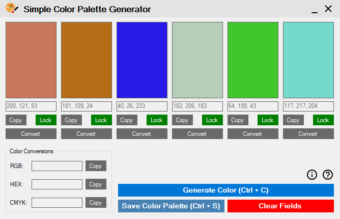
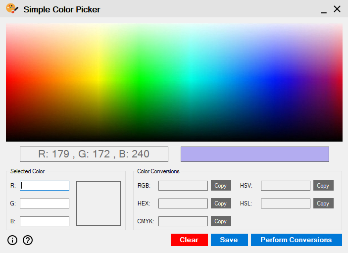

# Color Apps In C# .NET WinForms

A collection of professional color utility applications developed using C# .NET Windows Forms. This repository contains two powerful color manipulation tools designed to help designers, developers, and digital artists work with colors efficiently.


## 📋 Table of Contents

- [Projects Overview](#projects-overview)
- [Features](#features)
- [Technologies Used](#technologies-used)
- [Project Structure](#project-structure)
- [Installation](#installation)
- [Usage](#usage)
- [Screenshots](#screenshots)
- [Contributing](#contributing)

## 🎨 Projects Overview

This repository contains three main projects:

### 1. **Color Palette Generator**
A sophisticated tool for generating harmonious color palettes with six colors. Perfect for designers who need quick color scheme inspiration with the ability to lock specific colors while regenerating others.

### 2. **Color Picker**
An interactive color picker that allows users to capture colors from a full spectrum display. Ideal for precise color selection and conversion across multiple color formats.

### 3. **ExternalClasses**
A shared class library containing reusable color conversion algorithms and file operations used by both applications.

## ✨ Features

### Color Palette Generator

- **Random Color Generation**: Generate six random colors instantly
- **Color Locking**: Lock individual colors to preserve them while regenerating others
- **Color Conversions**: Convert RGB colors to:
  - HEX (Hexadecimal)
  - CMYK (Cyan, Magenta, Yellow, Key/Black)
- **Copy to Clipboard**: One-click copy for any color value
- **Save Palette**: Export generated color palettes to a text file on desktop
- **Keyboard Shortcuts**:
  - `Ctrl + C`: Generate new colors
  - `Ctrl + S`: Save palette
- **Clear All**: Reset all colors and values at once
- **Custom Window Controls**: Draggable title bar, minimize, and close buttons

### Color Picker

- **Interactive Color Spectrum**: Click anywhere on the color spectrum to select colors
- **Live Preview**: Real-time color preview as you hover over the spectrum
- **Manual RGB Input**: Enter specific RGB values (0-255) for precise color selection
- **Comprehensive Color Conversions**: Convert selected colors to:
  - RGB (Red, Green, Blue)
  - HEX (Hexadecimal)
  - CMYK (Cyan, Magenta, Yellow, Key/Black)
  - HSV (Hue, Saturation, Value)
  - HSL (Hue, Saturation, Lightness)
- **Copy to Clipboard**: Copy any color format with a single click
- **Save Colors**: Export color details with all conversions to a text file
- **Input Validation**: Automatic validation for RGB values (0-255 range)
- **Custom Window Controls**: Draggable title bar with tooltips

### Shared Features (Both Apps)

- **Help Documentation**: Built-in help system
- **About Information**: Application details and credits
- **File Export**: Automatic file creation on desktop with timestamp
- **Modern UI**: Clean, intuitive interface design
- **Error Handling**: Comprehensive error messages and validation

## 🛠️ Technologies Used

- **Language**: C# (.NET Framework)
- **UI Framework**: Windows Forms
- **IDE**: Visual Studio 2019/2022
- **Target Framework**: .NET Framework 4.x
- **Architecture**: Multi-project solution with shared libraries

## 📁 Project Structure

```
Color-Apps-In-Csharp-WinForms/
│
├── ColorPaletteGenerator/          # Color Palette Generator Application
│   ├── MainForm.cs                 # Main application form
│   ├── AboutForm.cs                # About dialog
│   ├── HelpForm.cs                 # Help documentation
│   └── resources/                  # Application resources
│
├── ColorPickerApp/                 # Color Picker Application
│   ├── MainForm.cs                 # Main application form
│   ├── AboutForm.cs                # About dialog
│   ├── HelpForm.cs                 # Help documentation
│   └── resources/                  # Application resources
│
├── ExternalClasses/                # Shared Class Library
│   ├── Conversions.cs              # Color conversion algorithms
│   │   ├── RGBToCMYK()            # RGB to CMYK conversion
│   │   ├── RGBToHSV()             # RGB to HSV conversion
│   │   └── RGBToHSL()             # RGB to HSL conversion
│   └── FileOperations.cs           # File I/O operations
│       ├── WriteColorInFile()      # Save single color details
│       └── WriteGeneratedColorsInFile()  # Save color palette
│
├── ColorPickerApp.sln              # Visual Studio Solution
├── preview_color_palette_generator.PNG
├── preview_color_picker.PNG
└── README.md
```

## 🚀 Installation

### Prerequisites

- Windows OS (Windows 7 or later)
- .NET Framework 4.x or later
- Visual Studio 2019/2022 (for development)

### Steps

1. **Clone the repository**
   ```bash
   git clone https://github.com/mubbashir-ahmed/Color-Apps-In-Csharp-WinForms.git
   ```

2. **Open the solution**
   - Navigate to the project directory
   - Open `ColorPickerApp.sln` in Visual Studio

3. **Build the solution**
   - Right-click on the solution in Solution Explorer
   - Select "Build Solution" or press `Ctrl + Shift + B`

4. **Run the applications**
   - Set either `ColorPaletteGenerator` or `ColorPickerApp` as the startup project
   - Press `F5` to run in debug mode or `Ctrl + F5` to run without debugging

## 📖 Usage

### Color Palette Generator

1. **Generate Colors**: Click "Generate Colors" or press `Ctrl + C` to create a new palette
2. **Lock Colors**: Click the lock button (turns red) to preserve specific colors during regeneration
3. **Convert Colors**: Click the convert button next to any color to see its HEX and CMYK values
4. **Copy Values**: Use the copy buttons to copy color values to clipboard
5. **Save Palette**: Click "Save" or press `Ctrl + S` to export the palette to your desktop
6. **Clear All**: Reset all colors and start fresh

### Color Picker

1. **Select Color**: 
   - Hover over the color spectrum to preview colors
   - Click to select a color
2. **Manual Input**: Enter RGB values (0-255) in the input fields
3. **Convert**: Click "Convert" to see the color in all formats (RGB, HEX, CMYK, HSV, HSL)
4. **Copy**: Use individual copy buttons for each color format
5. **Save**: Export the color details with all conversions to a text file
6. **Clear**: Reset all fields and start over

### Output Files

Both applications save files to your desktop:
- **Color Palette Generator**: Creates `Color Palette.txt` with all six colors
- **Color Picker**: Creates `Color Scheme.txt` with detailed color information and timestamp

## 📸 Screenshots

### Color Palette Generator


### Color Picker


## 🤝 Contributing

Contributions are welcome! Please feel free to submit a Pull Request.

## 📝 License

This project is open source and available under the [MIT License](LICENSE).

## 🙏 Acknowledgments

- Color conversion algorithms based on standard color space mathematics
- Windows Forms framework by Microsoft
- Community feedback and contributions

---

⭐ If you find this project useful, please consider giving it a star!
